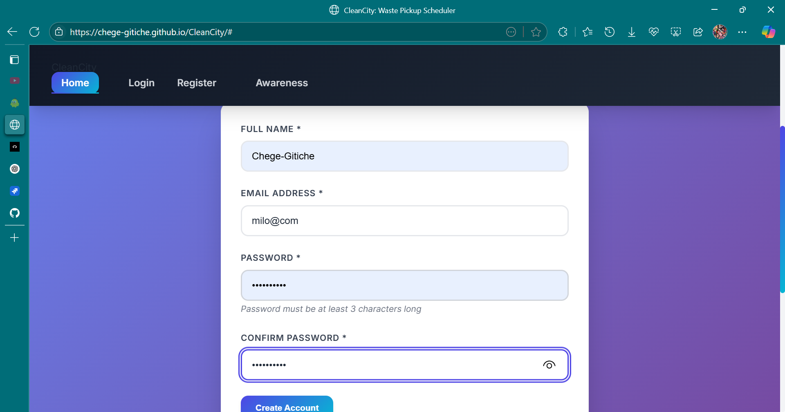
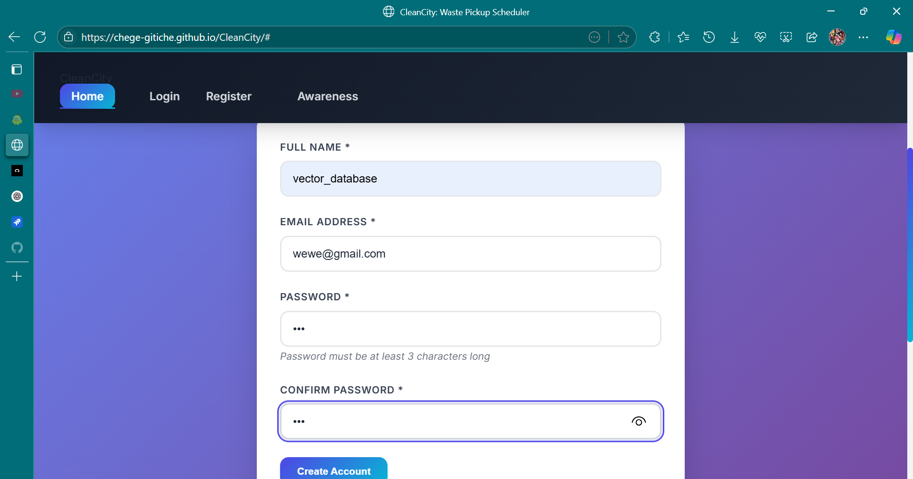
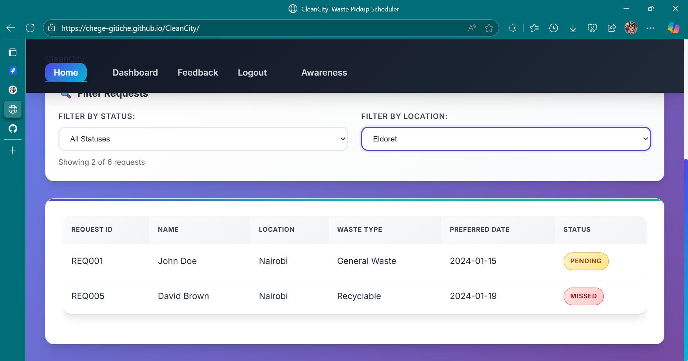
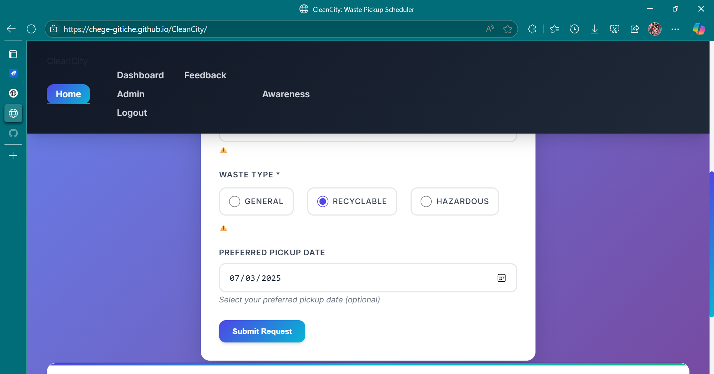
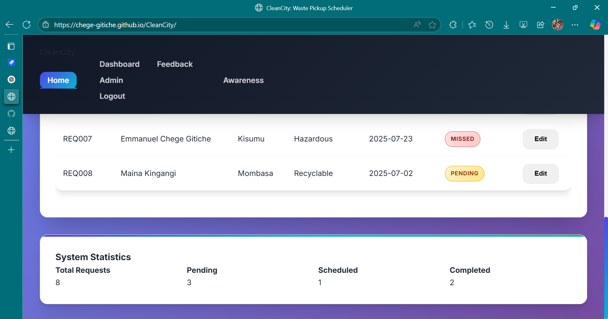
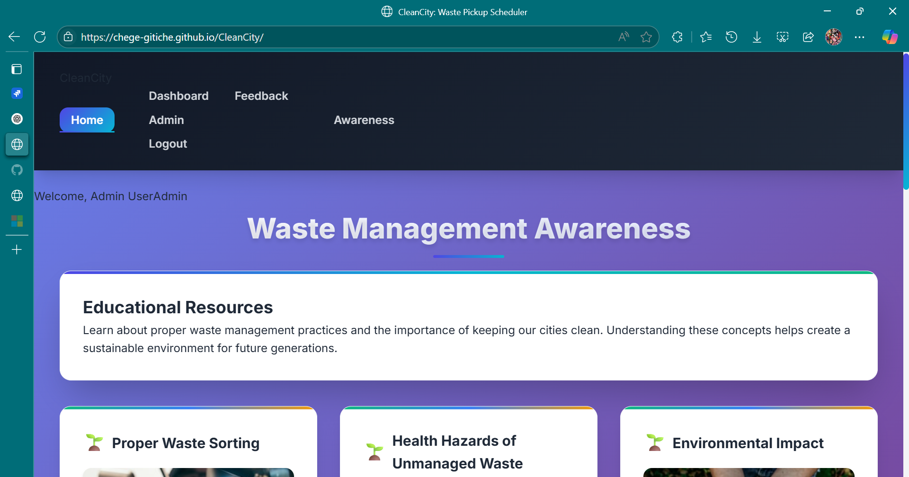

# 🐞 CleanCity Security & Bug Report

This report highlights major security vulnerabilities and functional bugs discovered during testing of the CleanCity Waste Pickup Scheduler web application.

---

## 🔐 Security Vulnerabilities

### 1. Plaintext Password Storage
- **Issue:** User passwords are stored in localStorage as plain text.
- **Risk:** High — susceptible to theft via browser inspection or XSS attacks.
- **Location:** `dataService.addUser()` and login logic.

---

### 2. No Authorization Checks
- **Issue:** Any user can update or delete any user profile.
- **Risk:** Medium to High — allows account tampering.
- **Location:** `dataService.updateUser()` and `dataService.deleteUser()`.

---

### 3. Insecure Session Management
- **Issue:** Session data is stored in localStorage with no expiration or protection.
- **Risk:** High — sessions can be hijacked or persist indefinitely.
- **Location:** `dataService.getCurrentUser()`

---

### 4. Vulnerable to IDOR
- **Issue:** Users can access others’ data via ID-based functions without restriction.
- **Risk:** High — privacy violation and data leakage.
- **Location:** `getUserById(userId)`, `getUserByEmail(email)`

---

### 5. Input Validation Weakness
- **Issue:** Password and name validations are weak; email validation is minimal.
- **Risk:** Medium — allows low-quality or harmful data.
- **Examples:**
  - Password accepts only 3 characters
  - Name accepts 2 characters
  - Email uses basic `includes("@")` check

---

## 🧪 Functional Bugs

### 6. Location Filter Bug
- **Issue:** Filtering pickup requests by "Eldoret" shows results from "Nairobi".
- **Impact:** Incorrect data display.
- **Location:** `filterRequestsByLocation(location)` function.

---

### 7. Feedback Form — Missing Required Validation
- **Issue:** Feedback comment field is not validated.
- **Impact:** Users can submit empty feedback.
- **Location:** `validateFeedbackForm()`

---

### 8. Pickup Request Date — Not Enforced
- **Issue:** Preferred date is optional even though scheduling depends on it.
- **Impact:** May create unusable pickup requests.
- **Location:** `validatePickupForm()`

---
### 9. Invalid Email Format Accepted
**Summary:**  
Website accepts invalid email format: `user@com`

**Description:**  
During registration testing, the system incorrectly accepts the email `user@com`, which lacks a valid domain suffix (e.g., `.com`, `.org`). This bypasses standard email validation rules.

**Environment:**  
- **Browser:**  Microsoft Edge 

**Severity:** Minor  
**Priority:** Medium  

**Steps to Reproduce:**
1. Go to the registration page  
2. Enter name and password fields with valid values  
3. Enter email as `user@com`  
4. Submit the form  

**Expected vs Actual:**
- **Expected:** The system should display an error like “Invalid email format” and prevent submission.  
- **Actual:** The system accepts the email and proceeds with registration.

**Attachments:**

### 10. Weak Password Policy Enforced
**Summary:**  
Password policy too weak — accepts passwords with only 3 characters and no complexity requirements

**Description:**  
The system allows users to register with passwords as short as 3 characters and doesn't enforce complexity rules (no numbers, symbols, or uppercase letters required). This is a major security risk and encourages poor password practices.

**Environment:**  
- **Browser:** Microsoft Edge  

**Severity:** Major  
**Priority:** High  

**Steps to Reproduce:**
1. Navigate to the registration page  
2. Enter a valid name and email  
3. Enter password as `abc` or `123`  
4. Confirm password  
5. Submit the form  

**Expected vs Actual:**
- **Expected:** Password should be rejected if it’s too short or lacks required complexity.  
- **Actual:** Passwords like `abc` or `123` are accepted.

**Attachments:**

### 11. Incorrect Data When Filtering by Location

**Summary:**  
Filtering by location returns incorrect results — Eldoret shows Nairobi data.

**Description:**  
In the dashboard, when a user selects "Eldoret" from the location filter, the results shown are for "Nairobi". This is misleading and breaks location-based analytics and reporting features.

**Environment:**  
- **Browser:** Microsoft Edge  

**Severity:** Major  
**Priority:** High  

**Steps to Reproduce:**
1. Log in to the dashboard  
2. Navigate to the analytics or requests section  
3. Select "Eldoret" from the location filter  
4. Observe that results belong to Nairobi instead

**Expected vs Actual:**
- **Expected:** Only requests from **Eldoret** should be displayed  
- **Actual:** Requests from **Nairobi** appear instead

**Attachments:**  

### 12. Past Dates Allowed in Pickup Request Form

**Summary:**  
Users can submit pickup requests for past dates

**Description:**  
The system does not restrict users from choosing a past date when scheduling a pickup. This can lead to invalid or confusing scheduling conflicts, especially when combined with auto-notifications and logistics planning.

**Environment:**  
- **Browser:** Microsoft Edge  

**Severity:** Moderate  
**Priority:** High  

**Steps to Reproduce:**
1. Go to the pickup request form  
2. Open the date picker  
3. Select a date prior to today (e.g., yesterday)  
4. Submit the request  

**Expected vs Actual:**
- **Expected:** The form should prevent users from selecting any date before today  
- **Actual:** The form allows and accepts past dates without validation

**Attachments:**  

### 13. Admin Cannot View User Feedback

**Summary:**  
Feedback submitted by users is not visible to admins

**Description:**  
Although the system allows users to submit feedback, the admin dashboard does not display any of the submitted feedback. This prevents admins from reviewing suggestions, issues, or compliments, limiting opportunities for improvement and user engagement.

**Environment:**  
- **Browser:** Microsoft edge 

**Severity:** Major  
**Priority:** High  

**Steps to Reproduce:**
1. Log in as a regular user  
2. Submit feedback using the provided feedback form  
3. Log out and log in as an admin  
4. Go to the admin feedback section  
5. Observe the feedback list or data panel  

**Expected vs Actual:**
- **Expected:** Admin should see a list of feedback entries submitted by users  
- **Actual:** Feedback section is blank or inaccessible despite active submissions  

**Attachments:**  

### 14. Blog System Missing from Platform

**Summary:**  
The blog system expected in the platform is completely missing

**Description:**  
According to the original scope and design, a blog system was to be implemented to allow admins to publish articles and users to read them. However, in the current deployment, there is no access point, feature, or page corresponding to a blog. This affects the delivery of informational or educational content through the platform.

**Environment:**  
- **Browser:** Microsoft Edge 

**Severity:** Critical  
**Priority:** High  

**Steps to Reproduce:**
1. Open the application  
2. Look for blog link or article section in navigation  
3. Try accessing `/blog`, `/posts`, or other known routes  
4. Check if admin panel contains any blog management tools  
5. Confirm that no blog-related UI or logic exists  

**Expected vs Actual:**
- **Expected:** Platform should have a functioning blog system with pages for reading and publishing posts  
- **Actual:** No blog interface, routes, or admin controls are present

**Attachments:**  

## ✅ Confirmed Fixes by Jest Tests
- XSS input is sanitized
- Weak passwords rejected
- Email format validated
- Empty comments blocked
- Name length enforced

---

## 📌 Recommendation
- Fix all critical security issues
- Improve validation across all user input
- Implement basic role-based access checks for user actions

---

**Tested by:** QA Analyst  
**Test Tool:** Jest + Manual Code Review  
**Date:** July 2025
